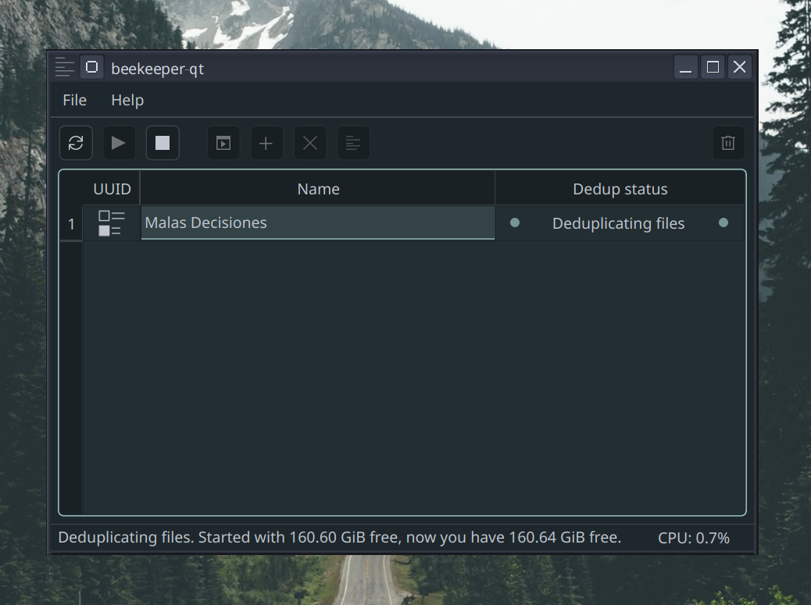

# beekeeper-qt

**Deduplicate redundant data in your disk and save space**    

beekeeper-qt lets you free up disk space by removing redundant block-level data, both inside files and across multiple files. It is based on [bees](https://github.com/Zygo/bees), which does the actual deduplication, and gives you a simple graphical interface to configure and run it without hassle.

> Transparent compression is now fully supported on beekeeper-qt on all the algorithms and levels the *btrfs* driver supports. Set it up along with deduplication with the *Setup* button.

> Note: `beekeeper-qt` is primarily written for Arch Linux and not thoroughly tested in other distros. Feel free to file an issue if bugs happen.



*A quick screenshot I took to the UI. The CPU meter shows the total CPU usage of the entire system, not just by beekeeper-qt.*

**IMPORTANT:** beekeeper-qt works **exclusively** with the **btrfs** filesystem. It will **not** work with any other filesystem because the `bees` service by Zygo is only designed to work on *btrfs*.

## Why

Many disks, even those of everyday users, have a lot of repeated data taking up space unnecessarily:  

- Duplicate documents, photos, videos, or files repeated across different folders.  
- Programs and executables that contain multiple repeated binary overhead patterns.  
- Wine prefixes or virtual environments that replicate large chunks of data.  
- Database systems or servers storing repeated blocks.  

beekeeper-qt finds these redundant patterns and compresses or deduplicates them, freeing up space. Now that it supports **automatic transparent compression**, every new file written in your disk is compressed just-in-time to be able to fit more of your files in your disk, especially if it has a small capacity.

You can control the compression level with the **Setup** button and turn it off if you prefer, but note, **deduplication alone doesn't free up too much space**, hence why filesystem compression management was added.

When you open the program, it automatically obtains the privileges needed to deduplicate your disk via a system service, so you **don’t** need to type your password every time you want to use it.

## Features

- Deduplication of redundant data at the block level across your entire disk.
- Transparent file compression-to save even more space
- Quick configuration from the program **controls**.  
- Start deduplication automatically at system startup with one click.  
- CPU usage is minimal after the first deduplication.

## Installation

You can find packages for both `bees` and `beekeeper-qt` in this repo's [GitHub Releases](https://github.com/techmanwalker/beekeeper-qt/releases) page. They automatically pull the required dependencies.
> Note: for Ubuntu you need to [enable the *universe* repository](https://askubuntu.com/questions/148638/how-do-i-enable-the-universe-repository).

Root privileges are handled automatically by the systemd service.

## Build - only do this if packages aren't available for your distro

You need Qt6 6.5+ to build beekeeper-qt. You'll also need some extra build dependencies for optimal runtime speed. I provide the full lists below.

### Build for Arch

To build for Arch, you simply need to use the PKGBUILD.
Build with this command:

```
makepkg -s
```

To generate the installable packages for Arch Linux.

### Build for other distros

If you are on Fedora, install dependencies with:

```
sudo dnf -y update
sudo dnf -y install \
    qt6-qtbase-devel qt6-qttools-devel \
    polkit-qt6-1-devel \
    libblkid-devel systemd-devel \
    gcc-c++ cmake ninja-build pkgconfig \
    rpm-build rpmdevtools make git
```

On Debian:

```
sudo apt-get update
sudo apt-get install -y \
    qt6-base-dev qt6-tools-dev libpolkit-qt6-1-dev \
    libblkid-dev libudev-dev build-essential cmake ninja-build fakeroot dpkg-dev git pkgconf
```

On Arch:
```
sudo pacman -Syu --noconfirm
sudo pacman -S --noconfirm base-devel git cmake ninja \
    qt6-base qt6-tools polkit-qt6 systemd btrfs-progs \
    util-linux doxygen bees
```


To build `beekeeper-qt`:

```bash
git clone https://github.com/techmanwalker/beekeeper-qt
cd beekeeper-qt
cmake -B build -G Ninja -DCMAKE_BUILD_TYPE=Release
cmake --build build
```

To generate `.deb` and `.rpm` packages:

```
cd build
cpack -G DEB
cpack -G RPM
```

CPack will print the package paths so you can copy them anywhere else.

If you instead want to quickly try out the compiled build, install it with:

```
sudo cmake --install build
```

And if you later want to switch to an official package, uninstall the build with:

```
sudo cmake --build build --target uninstall
```

Runtime dependencies are pulled by the packages when installed.

## Usage

1. Open beekeeper-qt and press **Setup** in the program controls.
2. Press Enter to accept default values or adjust them as needed.
3. Use the **+** button to enable deduplication at system startup (you can remove it later with **-**)

**Note:** The first time you run deduplication, CPU usage may reach near 100% depending on disk usage and hardware. This is normal and **only happens the first time; subsequent sessions will have minimal impact on CPU usage**. It’s recommended to do the first deduplication when you're not actively using the computer.

## Notes

* The first deduplication may take a while and consume a lot of CPU; following runs are much lighter.
* Transparent compression is now fully implemented.
* Works well both on regular desktops and on low-storage systems, and also useful for servers with repeated data patterns.

**FAQ / Quick tips**
- First deduplication may take some time; CPU usage can spike temporarily.
- Compression only applies to new files; run the one-time command for existing data (shown in Setup window).

## Contributions, License & Credits

* Pull requests are welcome. Please follow the current coding style and describe your changes clearly. Documentation is in [`docs/`](docs/).
* Licensed under [GPLv3](https://www.gnu.org/licenses/gpl-3.0.html)
* Special thanks to Zygo, for helping bring this project to life by creating [bees](https://github.com/Zygo/bees)!
* beekeeper-qt by itself is original work by [techmanwalker](https://github.com/techmanwalker).